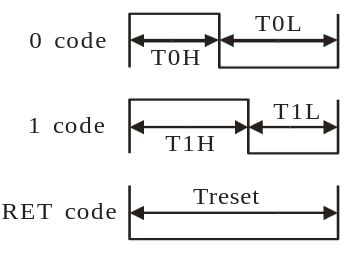
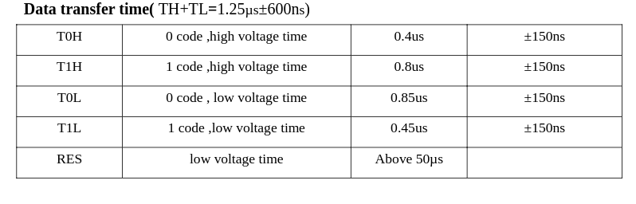
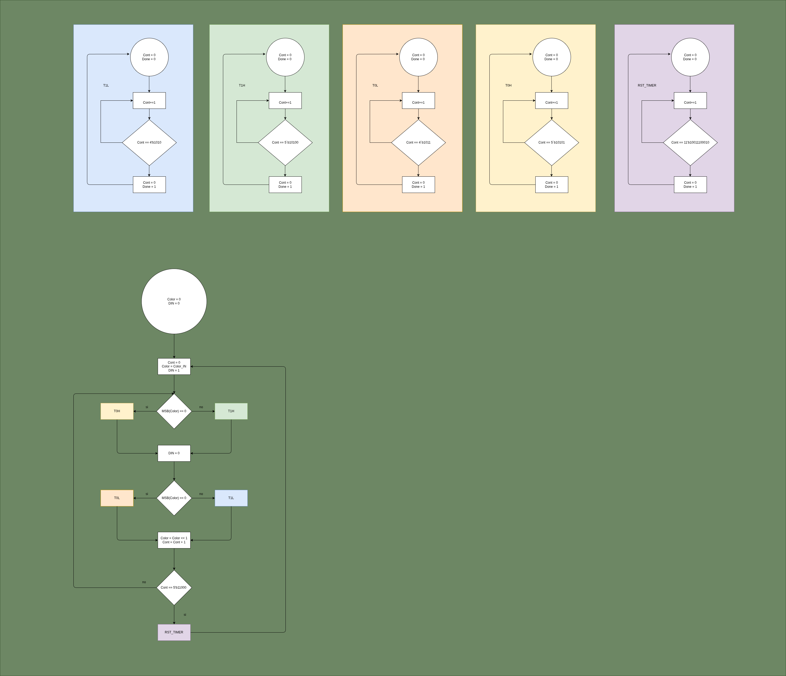
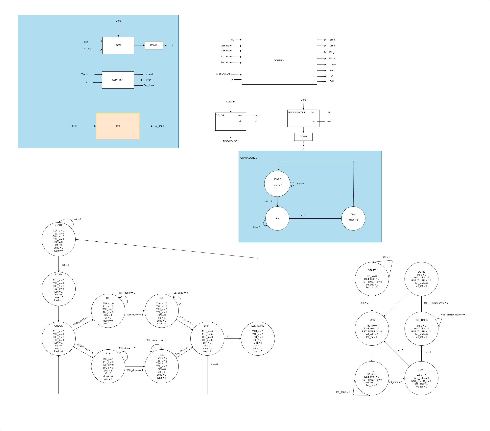
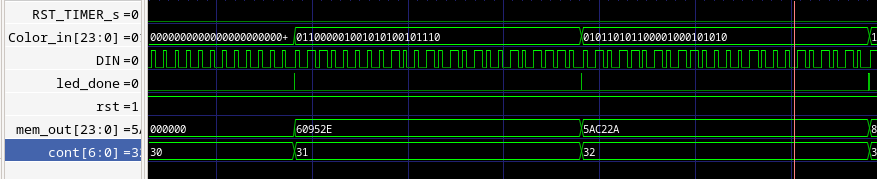
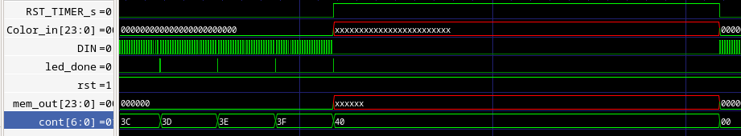

# Controlador de la matriz led 8x8 con diodos LED WS2812

## Requerimientos

Se requiere un controlador que, dada una cadena de bits, o archivo de memoria iniciado con la imagen deseada, realize el envio de datos a una matriz led de diodos WS2812, cada diodo tiene las siguientes especificaciones para el envio de bits:

### Codigos para envio y muestra de bits.

Para el envio de un bit a uno de los diodos se tiene disponibilidad de un pin D_IN, dependiendo del tiempo que este en nivel alto y bajo el controlador interno del modulo realiza la interpretacion para enviar un 1 o un 0. Los requerimientos de tiempo son los siguientes:

### Envio de varios bits

Todos los LED de la matriz estan conectados en serie, se establece que al realizar el envio de todos los bits en la cadena cada diodo "agarra" paquetes de 24 bits y envia los restantes al siguiente que repite este ciclo hasta completar todos los LED, el paquete de 24 bits debe tener formato GRB de 8 bits por color. Al finalizar el envio de la informacion de todos los bits de todos los LED presentes en la matriz (en este caso 64) se debe enviar el comando de reset para iluminar los LED con los colores correspondientes.

## Implementacion en verilog

Parala implementacion en verilog se cuenta con dos modulos (./dependencies) los cuales se encargan de lo siguiente:

### Modulo txx

Es un contador parametrizado que se encarga de mantener un estado los diferentes tiempos necesarios para el envio de los distintos comandos (T1H, T1L, T0H, T0L, RESET).

### Modulo LED

Recibe los 24 bits de color de un LED y establece el pin DIN en nivel alto o nivel bajo durante los diferentes tiempos necesarios para el envio de los 24 bits a un LED.

Ademas de esto se cuenta con una maquina de estados principal la cual se encarga de cambiar la informacion del LED que se va a enviar al finalizar el envio de datos de un LED para enviar los del siguiente, y de activar, al finalizar la secuencia de envio de los 64 LEDs, el contador de la señal de RESET para la muestra de los datos.

## Diagrama de flujo

## Maquina de estados

## Simulacion con GTKwave

## Archivos de simulacion:

[Simulacion simple](./simulation/simple/led_matrix/signals.gtkw)

[Simulacion post sintesis](./simulation/post_synth/signals.gtkw)

