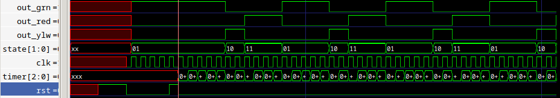
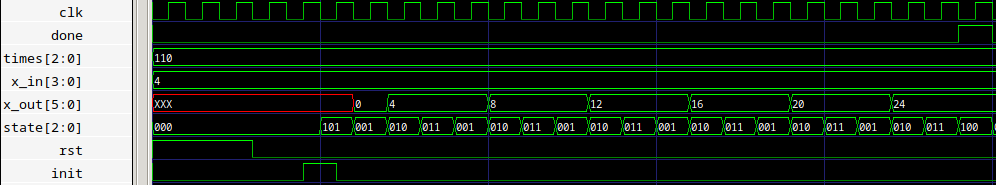
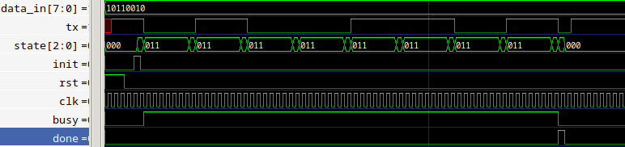

# 2026-1_Lab_ED2_G1_Entregas

En el desarrollo de esta práctica se busca recordar la utilización de las herramientas básicas para el curso de Electrónica Digital II con un enfoque en el diseño, modelado y simulación de sistemas digitales mediante el uso del lenguaje de descripción de hardware Verilog.

En este caso la practica esta enfocada al desarrollo de algoritmos simples, la implementacion de sus respectivas testbench y la simulacion mediante el uso de GTKWave. 

El primer ejercicio propuesto se trata de una maquina de estados finita para la aplicacion de un semaforo, este consta de tres estados y tiene una estructura como se observa a continuación:

En este caso noo es necesario implementar ningun algoritmo puesto que la unica informacion de interes es en que estado se encuentra la maquina de estados en cada momento, esto se puede observar viendo las formas de onda obtenidas en la simulacion con GTKWave.

Se puede observar que, luego de la señal de reset los tiempos de los estados se mantienen como se esperan en los requerimientos propuestos, tambien, antes de esta señal, el estado que se mantiene es GREEN, tal como se necesitaba.

El codigo necesario para esto se encuentra [aqui](Semaforo/).

Para el segundo ejercicio propuesto se realizo un Acumulador secuencial, el cual, dado un valor de entrada, lo acumula un numero de veces tambien dado (en el ejercicio el requerimiento era acumular un valor de veces establecido, pero se prefirio dejar esto como una entrada para abarcar varias de las variantes propuestas al mismo tiempo). 

En este caos se puede observar que se logró el resultado esperado, el valor de entrada (x_in) se fijó en 4, y se sumo un numero de veces (times) de 6 (en binario 110), en el valor de salida (x_out) se puede observar como cambia este cada vez que se suma, y con ayuda de la señal de done se puede ver cuando llega al final (cuando acumula el valor las veces que se fijo).

Para este ejercicio se desarrollo el anterior flujo de trabajo, donde primero se desarrollo un diagrama de flujo (algoritmo) y a partir de este se definio un camino de datos y una maquina de control (ASM). Todos los modulos necesarios en el flujo del programa se encuentran [aqui](Acumulador/) y los bloques generales utilizados, como comparadores y sumadores se encuentran [aqui](building_blocks/).  

Para el ultimo ejercicio se propuso un transmisor serial sincrono de 8 bits, el cual recibe un dato de entrada de 8 bits y lo transmite bit a bit por una linea serial, se optó por un diseño de LSB primero al no estar este requerimiento dentro de las especificacionen.

Al igual que en el caso anterior la metodologia de diseño se centro en el desarrollo de un diagrama de flujo, del cual se obtuvo toda la informacion necesaria para implementar un camino de datos y una maquina de control. Todos estos pasos se presentan a continuacion.

Con el algoritmo ya completo se implementó esto en [verilog](Transmisor_Serial/), se realizo una [testbench](Transmisor_Serial/test_benches/) para probar esto con ayuda de GTKWave y se simuló, el resultado fue el siguiente:

En este caso se puede utilizo un dato de entrada (data_in) igual a 178, cuando se inicia la transmision luego de la señal init, se mantiene cada uno de los bits de este numero, empezando por el ultimo, durante 8 ciclos de reloj, que, al terminar, cambia el dato al siguiente bit (o se mantiene en caso de ser igual al anterior) al completar los ocho bits se termina la transmision, desactivando la señal de busy, que esta en nivel alto mientras se transmiten los bits, y activando la señal de done.

Al igual que en el caso anterior, los bloques generales utilizados para el desarrollo (en este caso incluyendo el necesario para realizar los corrimientos) estan presentes en la carpeta de [building_blocks](building_blocks/). 