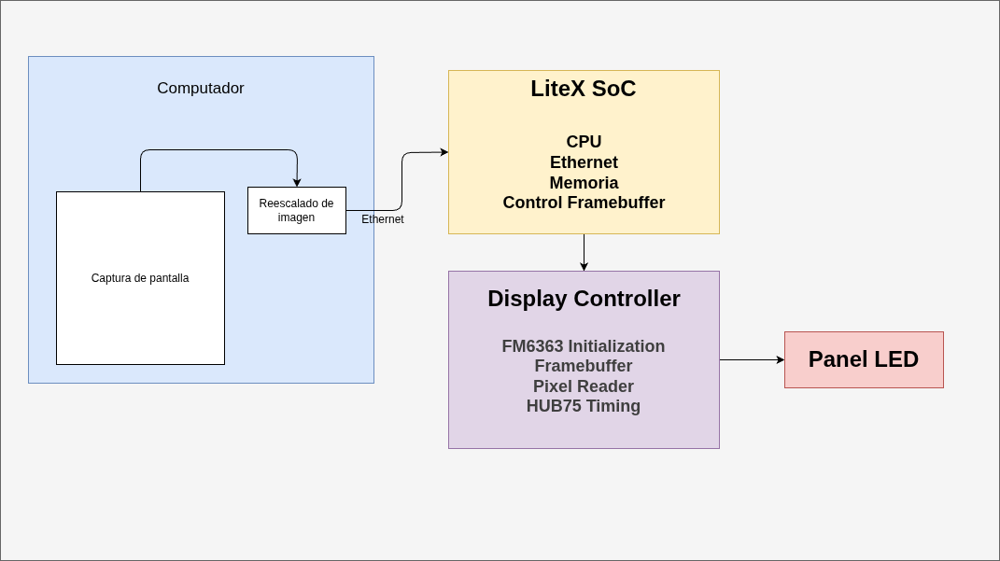
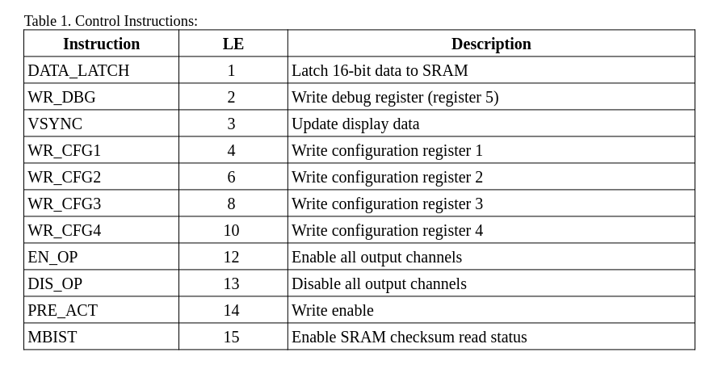
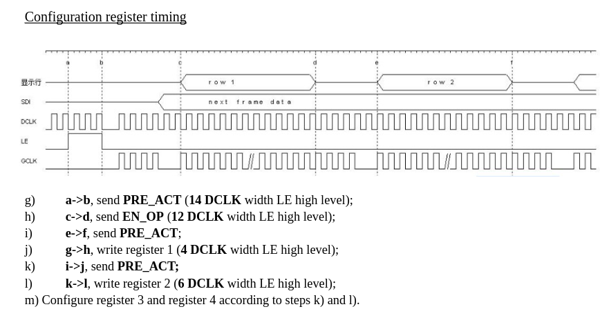
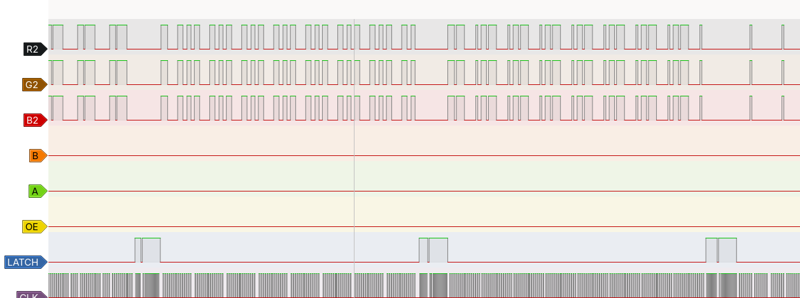
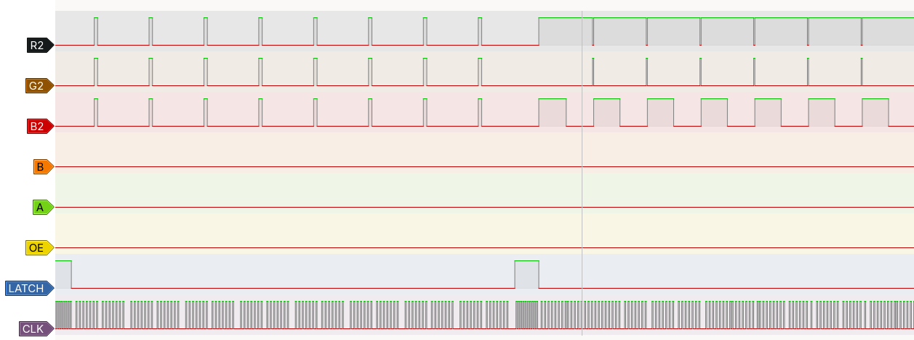
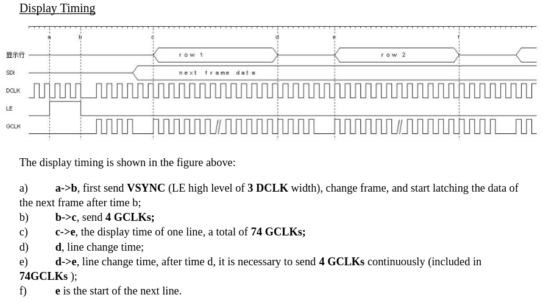
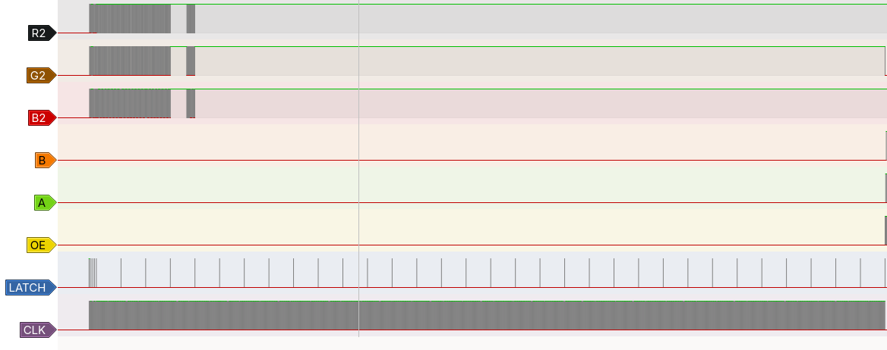
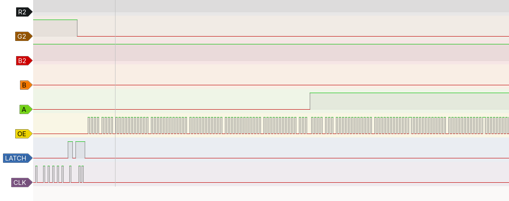
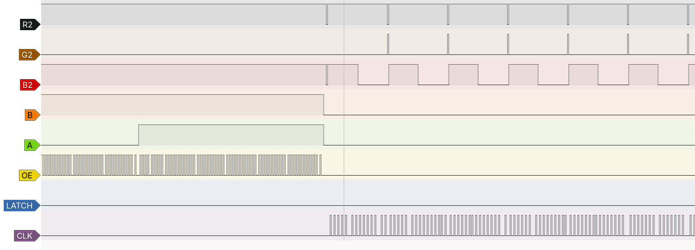

# FPGA Ethernet LED Matrix Display FM6363

## Universidad Nacional De Colombia - Electrónica Digital II

## Autor

*Daniel Santiago Puentes Villabona - 1052378730*

## Descripción General

Este proyecto implementa un sistema basado en FPGA para visualizar el contenido de una seccion de una pantalla de computador sobre un panel LED RGB. La plataforma utiliza LiteX para generar un System-on-Chip (SoC) que integra un procesador, memoria y periféricos, permitiendo la recepción de datos mediante Ethernet y el control del hardware de visualización.

El objetivo final es desarrollar una aplicación de escritorio que permita seleccionar una región de la pantalla del computador, similar a una herramienta de captura, escalarla a la resolución del panel y transmitirla en tiempo real a través de Ethernet. En la FPGA, el procesador LiteX será el encargado de recibir los paquetes de red y actualizar un framebuffer interno, mientras que un controlador implementado en Verilog realizará el refresco continuo del panel LED, incluyendo la inicialización del controlador FM6363.

## Características

- Arquitectura basada en un SoC generado con LiteX.
- Comunicación entre el computador y la FPGA mediante Ethernet.
- Captura y transmisión de una región seleccionada de la pantalla del computador.
- Controlador completamente desarrollado en Verilog.
- Inicialización automática de paneles con controlador FM6363.
- Framebuffer interno para almacenamiento de la imagen.
- Generación de señales RGB, CLK, LAT, OE y direccionamiento de filas.
- Arquitectura modular para facilitar la simulación y reutilización de componentes.
- Simulación RTL y post-síntesis del controlador.


## Arquitectura del Sistema 



## Organización del proyecto
``` 
PanelPWM
  ├── dependencies/           # Módulos auxiliares del controlador HUB75
  │   ├── test_benches/             # Testbenches de los modulos auxiliares
  ├── docs/                   # Imágenes y documentación
  ├── simulation/
  │   ├── simple/             # Simulaciones RTL
  │   └── post_synth/         # Simulaciones post-síntesis
  ├── test_benches/           # Testbenches del modulo principal
  ├── panel_pwm.v             # Módulo principal del controlador
  └── control_panel_pwm.v     # Máquina de estados principal
../building_blocks/            # Algunos otros modulos basicos utilizados (contadores, comparadores, registros, etc...)
```

## Hardware

El sistema fue desarrollado utilizando una FPGA Lattice ECP5 conectada a un panel LED RGB HUB75 con controlador FM6363.

### Componentes

- FPGA Colorlight 5A-75B (Lattice ECP5)
- Panel LED HUB75
- Controlador FM6363
- Comunicación Ethernet

## Arquitectura del Controlador

```
panel_pwm
│
├── control_panel_pwm
│
├── sendcfg
│
├── send_frame
│     └── pixel_reader
│           └── framebuffer
│
├── latch_command
│
└── four_clk
```

De acuerdo al datasheet del controlador FM6363 es necesario seguir una serie de pasos para tanto inicializar los controladores, como para mandar una serie de datos a traves de los pines RGB del HUB75. Gracias a los modulos sendcfg, latch_command y four_clk se puede realizar la inicialización de los controladores. Ademas, con el modulo send_frame se logra realizar el envio de datos RGB como se especifica en el datasheet. Como es necesario enviar varios distintos comandos en distintos momentos es necesario implementar una maquina de estados que active un modulo cuando sea necesario, y, cuando este modulo termine su operación, active el siguiente, esto se implementa gracias al modulo control_panel_pwm.

### Modulo latch_command
Este modulo se utiliza para realizar alguno de los comandos generados con latch segun el datasheet del FM6363, estos comandos se basan en mantener la señal de latch en nivel logico alto y mandando diferentes pulsos de DCLK (pin CLK del HUB75E). Los diferentes comandos disponibles se pueden ver a continuación.




### Modulo sendcfg
Este modulo se utiliza para enviar un registro de 16 bits de configuracion por los pines RGB a todos los controladores FM6363 del panel LED utilizado los registros de configuracion del FM6363. Ademas, al implentar este modulo con el latch_command, se logra mandar los comandos para escribir en esos registros y el timing necesario presente en el datasheet como se muestra a continuación.




Al realizar la implementacion en hardware fisico y medir con un analizador lógico cuales eran las señales que se obtenian de la FPGA se observaron las siguientes señales. 






### Modulo SendFrame

Luego de mandar los 4 registros de configuracion se empiezan a shiftear los datos del frame los cuales estan presentes en la memoria del proyecto framebuffer.mem, al terminar de mandar los datos de todos los pixeles del panel se envia el comando VSYNC y se mandan 4 pulsos de GCLK (pin OE del HUB75E) como frame header (modulo four_clk), luego se envian 74 pulsos de GCLK, al terminar se cambia de fila utilizando los pines ABCDE y se vuelven a enviar 74 pulsos. 



En las siguientes imagenes se puede observar la secuencia del envio de datos y la seecuencia de encendido de las filas implementado en hardware fisico.




Por ulltimo para actualizar la memoria del panel se mandar los datos del siguiente frame y se vuelve a repetir la secuencia como se muestra a continuación: 



## TODO...